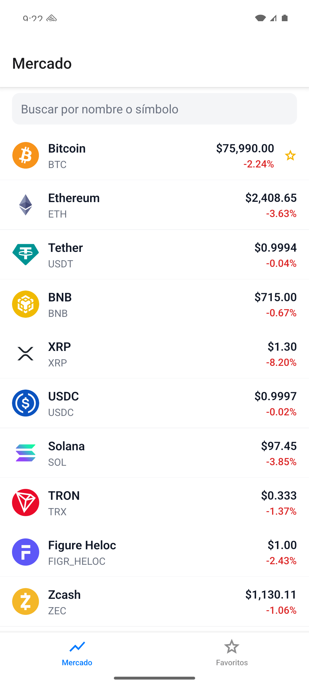
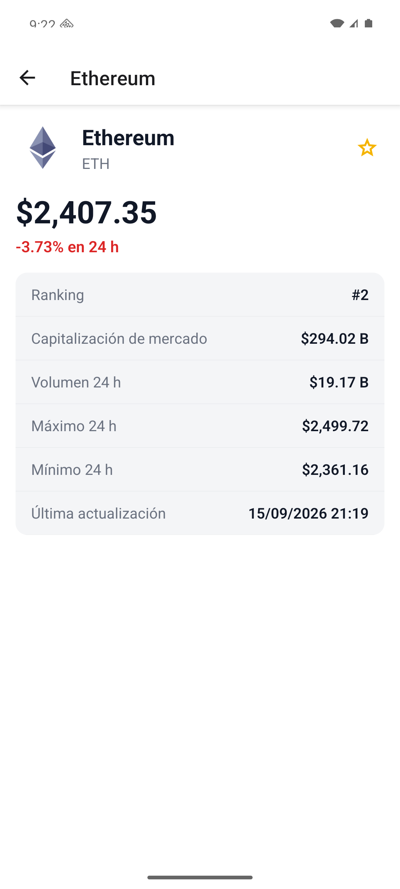
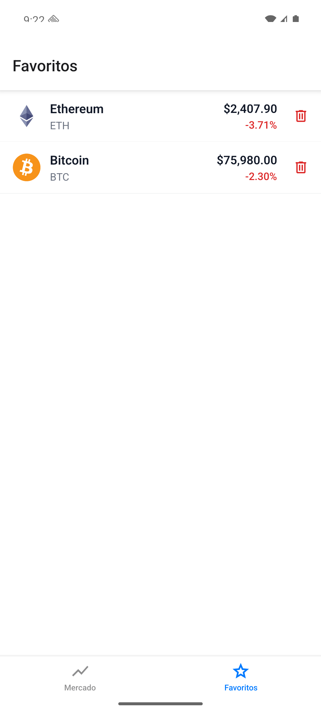

# Crypto Explorer

App móvil para explorar en tiempo real el mercado de criptomonedas y guardar monedas favoritas en el dispositivo, con consulta sin conexión.

Hecha con React Native + Expo (TypeScript). Los datos de mercado vienen de la API pública de CoinGecko y los favoritos se guardan en una base SQLite local.

## Capturas

| Mercado | Detalle | Favoritos |
|---|---|---|
|  |  |  |

## Contexto académico

Proyecto Programado 2, **Explorador de Datos y Consumo de APIs**, del curso **Programación para Dispositivos Móviles (TPA-4001)**, semanas 7 a 10.

Objetivos del proyecto:

- Consumir una API RESTful y manejar correctamente los estados de carga y de error.
- Implementar almacenamiento persistente local con SQLite.
- Manejar con estado global (Context API) la información que viene de la base de datos local.
- Separar la lógica de red, la lógica de base de datos y las vistas.

## Funcionalidades

| Pantalla | Qué hace |
|---|---|
| **Mercado** | Lista las 50 criptomonedas con mayor capitalización, con precio en USD y variación de 24 h. Incluye búsqueda por nombre o símbolo, pull-to-refresh y mensajes claros ante errores (sin conexión, tiempo agotado, límite de consultas) con opción de reintentar. |
| **Detalle** | Muestra datos ampliados de una moneda: ranking, capitalización, volumen, máximo y mínimo de 24 h y última actualización. Desde aquí se marca o desmarca como favorita. |
| **Favoritos** | Lista las monedas guardadas en el dispositivo, actualiza sus precios en una sola petición y permite eliminarlas con confirmación. Sin conexión muestra el último precio guardado. |

Los favoritos se conservan al cerrar la app, y cualquier cambio se refleja al instante en todas las pantallas.

## Requisitos

- **Node.js 20 o superior** (el proyecto se desarrolló con Node 26.3.1 y npm 11).
- **Expo Go** compatible con el **SDK 57**, en un iPhone o un dispositivo Android. También sirve el simulador de iOS o un emulador de Android.
- Conexión a internet para consultar la API de CoinGecko.

La web no está soportada: `expo-sqlite` necesita el módulo nativo de SQLite.

## Instalación y ejecución

```bash
git clone https://github.com/xJDevs/Mobile_Dev_P2.git
cd Mobile_Dev_P2
npm install
npx expo start
```

`npx expo start` levanta Metro y muestra un código QR. Con Expo Go se escanea desde la cámara en iOS o desde la propia app en Android. Con las teclas `i` y `a` se abre el simulador de iOS o el emulador de Android.

Scripts disponibles:

| Script | Qué hace |
|---|---|
| `npm start` | Levanta el servidor de desarrollo de Expo |
| `npm run ios` / `npm run android` | Abre la app en el simulador o el emulador |
| `npm test` | Corre las pruebas unitarias con Jest |
| `npm run lint` | Revisa el código con ESLint y Prettier |
| `npm run typecheck` | Verifica los tipos con `tsc --noEmit` |
| `npm run format` | Da formato a `src/` con Prettier |

## Variables de entorno

La app funciona sin configuración: usa la API pública de CoinGecko, que tiene un límite bajo de peticiones por minuto. Para subir ese límite se puede usar una demo key gratuita.

```bash
cp .env.example .env
```

| Variable | Obligatoria | Descripción |
|---|---|---|
| `EXPO_PUBLIC_COINGECKO_API_KEY` | No | Demo key de CoinGecko. Se envía en la cabecera `x-cg-demo-api-key`. |

`.env` no se versiona. Las variables `EXPO_PUBLIC_*` quedan embebidas en el bundle, así que solo se usa ahí la demo key gratuita. Después de cambiar `.env` hay que reiniciar Metro.

## Pruebas

```bash
npm test
```

Cubren la lógica pura de la app: mappers de la API, cliente HTTP con `fetch` simulado (éxito, fallo de red, timeout, 429, 404, 500 y JSON inválido), reducer de favoritos, filtro de búsqueda, formato de valores, mensajes de error y selección del precio de un favorito.

El repositorio SQLite no tiene pruebas automáticas, porque el módulo nativo no corre en Jest; se verifica a mano en el dispositivo.

## Arquitectura

La app se organiza en capas con dependencias en un solo sentido: **vistas → hooks/contexto → red/base de datos**.

```
src/
  app/               Rutas (Expo Router): solo declaran la navegación
  api/               Capa de red: cliente HTTP, errores tipados, DTO y mappers
  db/                Capa de datos local: conexión SQLite, migraciones y repositorio
  context/           Estado global de favoritos (Context API + reducer)
  hooks/             Estado de las peticiones remotas (carga, error, refresco)
  models/            Modelos de dominio
  screens/           Pantallas
  components/        Componentes de UI reutilizables
  utils/             Formato de valores y mensajes de error
```

Reglas entre capas:

- `models/` no depende de nada.
- `api/` y `db/` no importan React ni nada de `screens/`.
- Las pantallas no usan `db/` directamente: pasan por `context/` y `hooks/`.
- Los archivos de `app/` solo declaran navegación y renderizan una pantalla de `screens/`.
- Todo fallo de red se normaliza en un único tipo `ApiError` (`network`, `timeout`, `rate_limit`, `not_found`, `http`, `parse`); los textos para el usuario viven en `utils/errorMessages.ts`.
- El estado de favoritos cambia solo después de que la escritura en SQLite termina bien.

### API consumida

CoinGecko API v3, con base en `https://api.coingecko.com/api/v3` y un timeout de 15 segundos por petición.

| Uso | Endpoint |
|---|---|
| Listado de mercado | `GET /coins/markets?vs_currency=usd&order=market_cap_desc&per_page=50&page=1&sparkline=false&price_change_percentage=24h` |
| Detalle de una moneda | `GET /coins/{id}?localization=false&tickers=false&market_data=true&community_data=false&developer_data=false&sparkline=false` |
| Precios de favoritos | `GET /simple/price?ids={id1,id2,…}&vs_currencies=usd&include_24hr_change=true` |

No hay refresco automático ni periódico: la app pide datos al abrir cada pantalla, al reintentar y al deslizar hacia abajo.

### Base de datos local

Archivo `crypto-explorer.db`, abierto con `expo-sqlite` en modo WAL. Las migraciones se aplican según `PRAGMA user_version`.

```sql
CREATE TABLE favorites (
  coin_id        TEXT PRIMARY KEY NOT NULL,
  name           TEXT NOT NULL,
  symbol         TEXT NOT NULL,
  image_url      TEXT,
  last_price_usd REAL,
  saved_at       INTEGER NOT NULL  -- epoch ms
);
```

Operaciones del repositorio (`src/db/favoritesRepository.ts`), todas con consultas parametrizadas:

| Operación | Consulta |
|---|---|
| Leer | `SELECT … ORDER BY saved_at DESC` |
| Guardar | `INSERT … ON CONFLICT(coin_id) DO UPDATE SET …` (la clave primaria evita duplicados) |
| Eliminar | `DELETE FROM favorites WHERE coin_id = ?` |
| Actualizar precios | `UPDATE favorites SET last_price_usd = ?` dentro de una transacción |

## Tecnologías

- **React Native 0.86 + Expo SDK 57** (TypeScript), con **Expo Router** para la navegación
- **CoinGecko API v3** como fuente de datos de mercado
- **SQLite** (`expo-sqlite`) para la persistencia local
- **Context API + `useReducer`** para el estado global de favoritos
- **Jest** (`jest-expo`), **ESLint** y **Prettier** para calidad de código

Plataformas: iOS y Android.

## Flujo de trabajo

- **Planificación**: metodología Spec-Driven. El avance se sigue en Linear, con un issue por cada grupo de tareas.
- **Ramas**:
  - `main` es la versión de entrega.
  - `develop` es la rama de integración.
  - Cada issue se trabaja en su propia rama con el número del issue, por ejemplo `joe-132-capa-de-red`, y se integra a `develop` mediante un pull request.
- **Commits**: [Conventional Commits](https://www.conventionalcommits.org/) con el id del issue, por ejemplo `feat(api): cliente HTTP con timeout [JOE-132]`.

## Hoja de ruta

- [x] Configuración del proyecto y repositorio
- [x] Modelos y capa de red
- [x] Base de datos local (SQLite)
- [x] Estado global de favoritos
- [x] Navegación y componentes compartidos
- [x] Pantalla Mercado
- [x] Pantalla Detalle
- [x] Pantalla Favoritos
- [x] Verificación y documentación final
